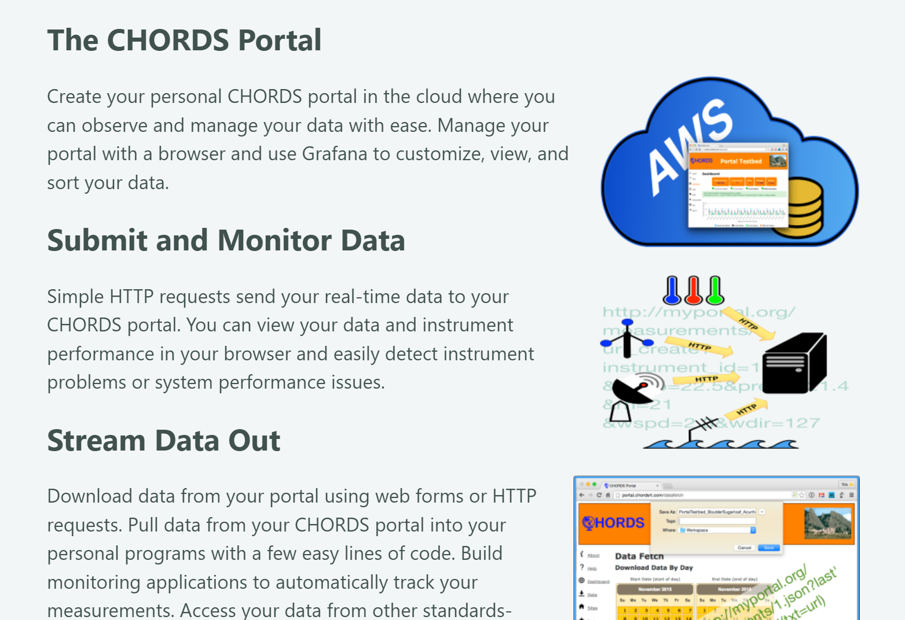

# The CHORDS platform for data 

[CHORDS](https://chordsrt.com) is a free and open source data platform for
storing all types of dat onto a cloud platform (your own or a commercial platform like AWS, Azure, etc.), but it is especially well
suited for atmospheric data of the type that would
come from weather stations.

[](https://www.chordsrt.com)


## How CHORDS works

CHORDS operates on a simple workflow:  

1. given a data **data producer** (sensor, instrument, machine, etc.), 
2. the data is **put into CHORDS** over the Internet, 
3. the data  can then be **visualized** and then
4. the data can be **retrieved, archived, analyzed** or sent to other devices (or whatever else you'd like to do with it).

This image shows the basic operation of CHORDS:

[](https://earthcubeprojects-chords.github.io/chords-docs/whatis/)

[Learn more about the CHORDS project.](https://www.chordsrt.com)

```{important}

**Citing the CHORDS project should be done with the folloing citation:**

> Michael D. Daniels, Branko Kerkez, V. Chandrasekar, Sara Graves, D. Sarah Stamps, Charles Martin, Aaron Botnick, Michael Dye, Ryan Gooch, Josh Jones, Ken Keiser, Matthew Bartos, Thaovy Nguyen, Robyn Collins, Sophia Chen, Terrie Yang, Abbi Devins-Suresh (2016). Cloud-Hosted Real-time Data Services for the Geosciences (CHORDS) software (Version 1.0.1). UCAR/NCAR - EarthCube. https://doi.org/10.5065/d6v1236q
```